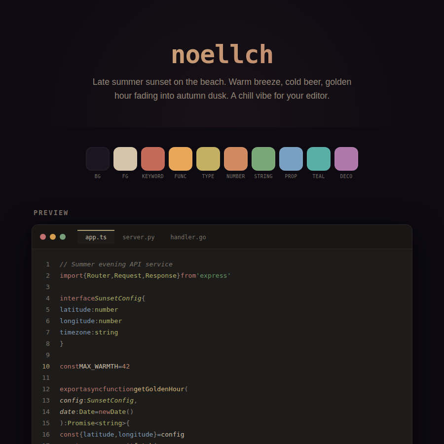

# noellch

Late summer sunset on the beach. Warm breeze, cold beer, golden hour fading into autumn dusk.

A faded film palette — like a Kodak print left in a shoebox for twenty years. Every color remembers what it used to be, but time has softened everything into a warm haze. The cool blue-grey background is the sky just after the sun dips below the horizon. The syntax colors are the last light catching on sand, driftwood, and shallow water.

Low saturation, low contrast, high comfort. Built for long sessions where you want to feel like you're still at the beach, even at 2am.

## Color Palette

| Role | Hex |
|------|-----|
| Background | `#252831` |
| Foreground | `#cec5b5` |
| Keyword | `#b58a81` — Sun-baked clay |
| Function | `#c9b696` — Golden hour |
| Type/Class | `#b1aa85` — Beach sand |
| Number | `#b79c8a` — Copper in golden light |
| String | `#91a087` — Beach grass |
| Property | `#8ea3ad` — Distant ocean |
| Teal accent | `#82a599` — Shallow warm water |
| Decorator | `#a58c9f` — Autumn dusk |
| Comment | `#717782` — Fading sky |

## Optimized For

TypeScript · JavaScript · Python · Go · JSON · Markdown · HTML · CSS

## License

MIT
